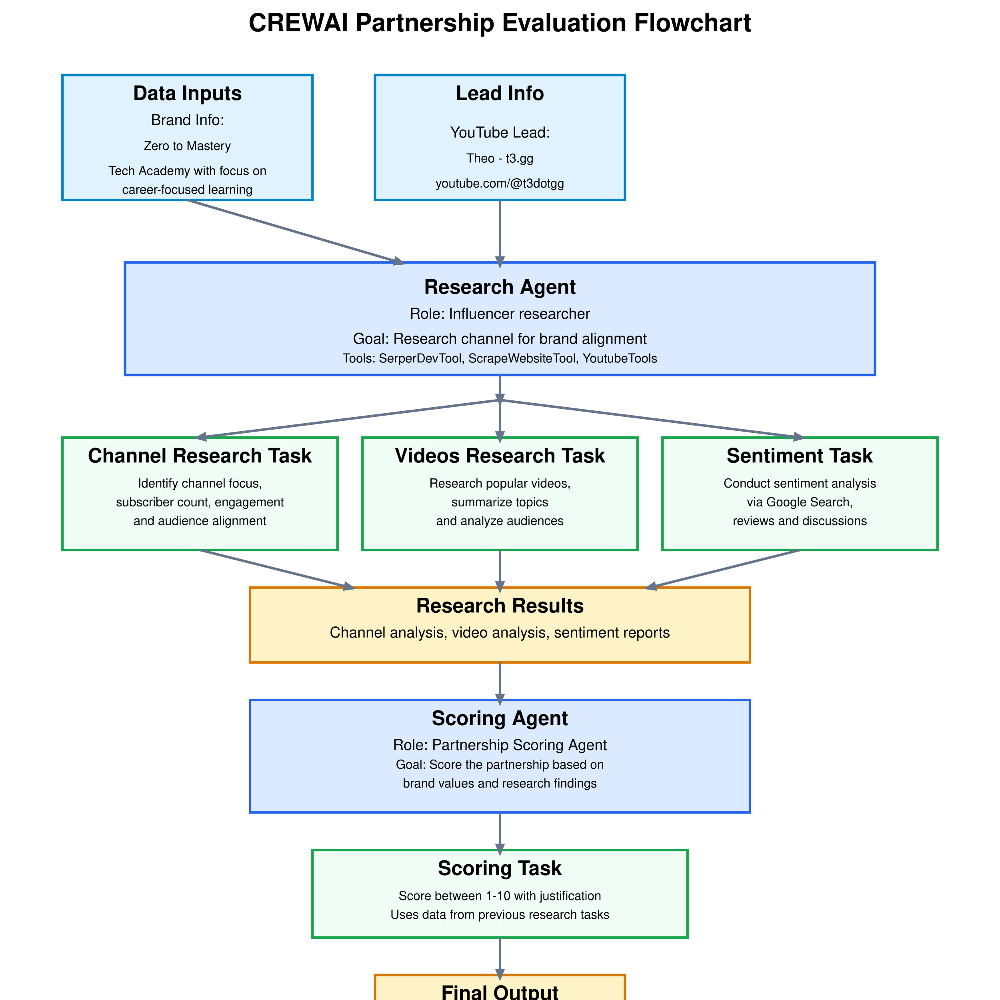

# CrewAI YouTube Partnership Scoring

## Table of Contents

- [Overview/Description](#overviewdescription)
- [Features](#features)
- [Technology Stack](#technology-stack)
- [How it Works](#how-it-works)
  - [Agents](#agents)
  - [Tasks](#tasks)
- [Project Analysis](#project-analysis)
  - [Project Purpose](#project-purpose)
  - [Workflow Implementation](#workflow-implementation)
  - [Technology Stack (Detailed)](#technology-stack-detailed)
  - [Data Inputs](#data-inputs)
  - [AI Agents (Detailed)](#ai-agents-detailed)
  - [Tasks (Detailed)](#tasks-detailed)
  - [Crew Configuration](#crew-configuration)
  - [Output Details](#output-details)
  - [Alignment with Briefing](#alignment-with-briefing)
  - [Potential Gaps/Improvements](#potential-gapsimprovements)
- [Setup and Installation](#setup-and-installation)
- [Usage](#usage)
- [Output Example](#output-example)

## Overview/Description

This project implements an automated system using CrewAI to evaluate and score potential YouTube channel partnerships for the **Zero to Mastery (ZTM)** brand. Sponsored by Andrei from ZTM, the goal is to streamline the assessment process, ensuring potential partners align with ZTM's core values: _Quality education, community-driven growth, career-focused learning, and up-to-date tech stacks_.

The system researches channels focusing on programming, software engineering, or tech career advice, analyzes their content and sentiment, and provides a score to aid in selecting the best partners quickly and consistently.

## Features

- **Automated Research:** Researches YouTube channel focus, content type, approximate subscriber count, and engagement levels.
- **Audience Alignment Check:** Assesses if the channel's audience aligns with ZTM's target demographic (motivated learners in tech).
- **Video Analysis:** Identifies and summarizes topics of popular videos on the channel.
- **External Sentiment Analysis:** Uses Google Search (specifically targeting Reddit) to gauge public sentiment and feedback about the channel.
- **Partnership Scoring:** Generates a numerical score (0-10) based on the research findings and ZTM's brand values.
- **Justification:** Provides a concise text justification explaining the rationale behind the assigned score.

## Technology Stack

- **Language:** Python 3.11
- **AI Framework:** CrewAI
- **LLM Orchestration:** LangChain (implicitly used by CrewAI)
- **LLM:** OpenAI GPT-4o (via `langchain-openai`)
- **Search/Scraping Tools (CrewAI Tools):**
  - `SerperDevTool` (Google Search API)
  - `ScrapeWebsiteTool`
  - `YoutubeChannelSearchTool`
  - `YoutubeVideoSearchTool`
- **Data Validation:** Pydantic
- **Environment Variables:** python-dotenv
- **Notebook:** Jupyter Notebook / IPython

## How it Works

This project leverages the CrewAI framework, utilizing AI agents to perform specific tasks sequentially:

### Agents

1.  **Influencer Researcher (`research_agent`):** Responsible for gathering information about the target YouTube channel, its content, audience, and external sentiment using various web search and scraping tools.
2.  **Partnership Scoring Agent (`scoring_agent`):** Responsible for evaluating the research findings (provided as context) against ZTM's brand values and generating a final partnership score and justification.

### Tasks

The crew executes the following tasks in order (`Process.sequential`):

1.  **Channel Research:** Gathers basic channel info, focus, and audience details.
2.  **Video Research:** Identifies popular videos and their topics.
3.  **Sentiment Analysis:** Searches external sources (like Reddit) for reviews and opinions.
4.  **Scoring:** Synthesizes all gathered information to produce the final score and justification using a Pydantic model for structured output.

---

## Project Analysis

This section provides a detailed analysis based on the project briefing and the implementation in the Jupyter Notebook (`Capstone Project - Starter Code.ipynb`).

### Project Purpose

- The project aims to create an automated system using CrewAI to evaluate and score potential YouTube channel partnerships for the "Zero to Mastery" (ZTM) brand.
- It solves the problem of manually researching and assessing numerous channels, intending to speed up the partnership assessment process and ensure selected partners align with ZTM's core values (quality education, community, career focus, up-to-date tech) and target audience (motivated learners in programming, software engineering, tech careers).

### Workflow Implementation

- **Setup:** Loads environment variables (API keys) using `dotenv` and imports necessary libraries (CrewAI, LangChain, OpenAI, CrewAI Tools, Pydantic). Initializes the `ChatOpenAI` LLM (`gpt-4o`).
- **Data Input:** Defines Python dictionaries `brand_info` (ZTM's identity, values, ideal partner) and `youtube_lead` (target channel name and URL).
- **Agent Definition:** Defines `research_agent` (researches channel suitability using tools) and `scoring_agent` (scores partnership based on research context).
- **Task Definition:** Defines sequential tasks: `channel_research_task`, `videos_research_task`, `sentiment_task`, and `scoring_task`. The scoring task uses the output of the previous three as context and structures its output using a Pydantic `Score` model.
- **Crew Configuration:** Assembles a `Crew` with the agents and tasks, set to run sequentially (`Process.sequential`).
- **Execution:** `crew.kickoff()` initiates the process.
- **Output:** The final `result` object contains task outputs. The notebook extracts and displays the raw output from each task using Markdown. The `scoring_task` output provides the structured score and justification.



### Technology Stack (Detailed)

- **Core Framework:** CrewAI
- **LLM Orchestration:** LangChain (used implicitly by CrewAI)
- **LLM Provider:** OpenAI (via `langchain-openai`)
- **LLM Model:** GPT-4o
- **AI Agents/Tasks:** CrewAI (`Agent`, `Task`, `Crew`, `Process`)
- **Tools:** CrewAI Tools:
  - `SerperDevTool` (for Google Search)
  - `ScrapeWebsiteTool` (for reading website content)
  - `YoutubeChannelSearchTool` (for searching channel content)
  - `YoutubeVideoSearchTool` (for searching specific video content)
- **Data Validation/Structuring:** Pydantic (`BaseModel`)
- **Environment Management:** python-dotenv
- **Notebook Environment:** Jupyter Notebook / IPython (`display`, `Markdown`)
- **Language:** Python

### Data Inputs

- `brand_info`: A dictionary containing ZTM's `name`, `description`, `brand_values`, and `ideal_partner` profile.
- `youtube_lead`: A dictionary containing the `name` and `channel_url` of the YouTube channel being evaluated.

### AI Agents (Detailed)

- **`research_agent`**:
  - `role`: "Influencer researcher"
  - `goal`: Research the specified YouTube channel (`Theo - t3․gg`) to assess suitability for Zero to Mastery.
  - `backstory`: Expert in influencer partnerships aligned with ZTM's values (Quality education, community-driven growth, career-focused learning, up-to-date tech stacks).
  - `tools`: `SerperDevTool`, `ScrapeWebsiteTool`, `YoutubeChannelSearchTool`, `YoutubeVideoSearchTool`.
- **`scoring_agent`**:
  - `role`: "Partnership Scoring Agent"
  - `goal`: Score the partnership between ZTM and the YouTube channel, assessing based on ZTM's brand values.
  - `backstory`: Expert in Influencer Marketing working for ZTM.
  - `tools`: None explicitly assigned (relies on context from previous tasks).

### Tasks (Detailed)

- **`channel_research_task`**:
  - `description`: Research channel focus, content type, subscriber count, engagement, and audience alignment with ZTM.
  - `expected_output`: "A research report on the channel's key attributes and audience"
  - `agent`: `research_agent`
- **`videos_research_task`**:
  - `description`: Research most popular videos, summarize topics, analyze audiences.
  - `expected_output`: "A research report on the most popular videos and their topics"
  - `agent`: `research_agent`
- **`sentiment_task`**:
  - `description`: Conduct sentiment analysis via Google Search (mentioning Reddit) for feedback, reviews, discussions.
  - `expected_output`: "A sentiment analysis report on the channel's"
  - `agent`: `research_agent`
- **`scoring_task`**:
  - `description`: Score the partnership between ZTM and the channel.
  - `expected_output`: "A score between 1 and 10 and justification for the scoring. An explanation of the score indicating what fits the brand and what does not"
  - `agent`: `scoring_agent`
  - `context`: Depends on the completion and output of `channel_research_task`, `videos_research_task`, `sentiment_task`.
  - `output_pydantic`: Uses the `Score` BaseModel (`score: int`, `justification: str`) to structure the output.

### Crew Configuration

- The `Crew` is configured with a list containing both agents (`research_agent`, `scoring_agent`) and a list containing all four tasks in the desired order.
- It uses `Process.sequential`, ensuring tasks run one after another, with the output of earlier tasks available as context for later ones (specifically for the `scoring_task`).

### Output Details

- The final output of the crew execution is captured in the `result` object.
- The notebook specifically accesses `result.tasks_output` to get the raw string outputs from each of the four tasks.
- The most critical output is from the `scoring_task`, which adheres to the `Score` Pydantic model, providing a JSON-like string containing an integer `score` (0-10) and a string `justification`.
- These individual outputs are displayed clearly at the end using Markdown formatting.

### Alignment with Briefing

- **Requirement 1 (Research channel focus, engagement, audience):** Met by `channel_research_task`.
- **Requirement 2 (Examine videos):** Met by `videos_research_task`.
- **Requirement 3 (Check external sentiment):** Met by `sentiment_task`.
- **Requirement 4 (Score with justification):** Met by `scoring_task` using the `Score` Pydantic model.
- **Implementation Guideline (Key findings, score 0-10, report):** Met. Task outputs are findings, scoring task provides score/justification, collectively forming the report elements.
- **Brand Objectives:** Integrated into agent goals/backstories and task context.
- **Goal (Speed up, Ensure match):** Directly addressed by the automated workflow and structured analysis.

### Potential Gaps/Improvements

- **Depth of Video Analysis:** The briefing asks for examining specific video details (views, comments, sentiment). The notebook currently focuses more on identifying popular video _topics_ via search rather than deep-diving into individual video content/comments sentiment using tools like `YoutubeVideoSearchTool`.
- **Report Synthesis:** The notebook outputs raw results from each task. A potential improvement could be adding a final task/agent to synthesize these into a single, unified report document as requested in the briefing ("report detailing the recommendation").
- **Score Range Consistency:** Minor difference between briefing (0-10) and task description (1-10), though the implementation correctly allows for 0-10.

---

## Setup and Installation

1.  **Clone the repository:**

    ```bash
    git clone <repository-url>
    cd <repository-directory>
    ```

2.  **Create and activate a virtual environment (recommended):**

    ```bash
    python -m venv venv
    # On Windows
    venv\Scripts\activate
    # On macOS/Linux
    source venv/bin/activate
    ```

3.  **Install dependencies:**

    ```bash
    pip install -r requirements.txt
    ```

    _(Note: You'll need to create a `requirements.txt` file based on the notebook imports, e.g., `pip freeze > requirements.txt` after installing manually)_

4.  **Configure Environment Variables:**

    - Create a `.env` file in the project root directory.
    - Add your API keys to this file. You can use `.env.example` as a template:

    **.env.example:**

    ```env
    OPENAI_API_KEY="your_openai_api_key_here"
    SERPER_API_KEY="your_serper_api_key_here"
    # Add any other necessary keys (e.g., specific YouTube API keys if Youtube tools require them)
    OPENAI_MODEL_NAME="gpt-4o" # Optional: specify model if not hardcoded
    ```

    - **Important:** Ensure the `.env` file is listed in your `.gitignore` file to avoid committing secrets.

## Usage

1.  **Ensure your `.env` file is populated** with the necessary API keys.
2.  **Open the Jupyter Notebook:**
    ```bash
    jupyter notebook "Capstone Project - Starter Code.ipynb"
    ```
3.  **Modify Inputs (Optional):** Update the `brand_info` and `youtube_lead` dictionaries in the notebook cells if you want to evaluate a different brand or channel.
4.  **Run the cells:** Execute the notebook cells sequentially from top to bottom.
5.  **View Results:** The outputs from each research task (Channel Research, Videos Research, Sentiment Analysis) and the final Scoring output will be displayed in the final cells of the notebook.

## Output Example

The final output from the scoring task will be a JSON-like structure adhering to the `Score` model:

```json
{
  "score": 8,
  "justification": "The partnership between Zero to Mastery and Theo - t3․gg scores an 8 out of 10. Theo's YouTube channel aligns well with Zero to Mastery's core values... His focus on full stack TypeScript and modern web development practices resonates with Zero to Mastery's audience... The channel's significant subscriber count and high engagement levels indicate a strong potential... However, some criticisms exist regarding Theo's communication style and perceived influence by sponsorships... Despite these concerns, the partnership remains highly beneficial..."
}
```
